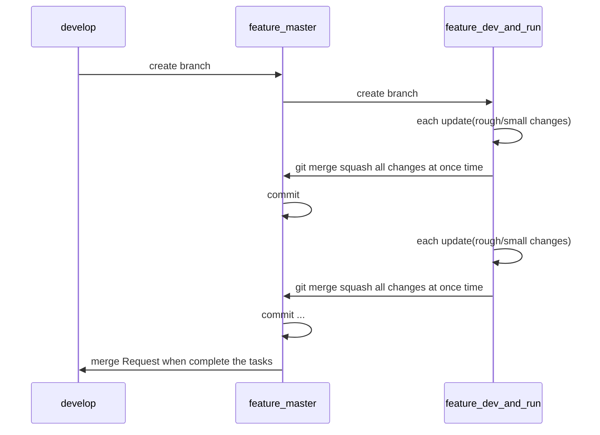

## 1. Branch rules:

### Develop rules:
- There are 2 protected branches: `master` and `develop`  
- Stage branch are branches that be used to develop new feature, fix issue,...

| master | develop |
| ------ | ------ |
| + Stable branch.  + All Jobs/Tools release to project must use/in `master` branch. + Create stage branches from `master` only in urgent issue and need hotfix.   | + Main branch for development, stage branches will be merged to `develop` branch first. + Stage branches will be created from `develop` branch. + `develop` branch will be synchronized with `master` after the hotfix. |  
- `feature_master`: branch will be used on merge request, small commit log, large change.  
- `feature_dev_and_run`: branch to develop and trial on Jenkins, it will have many redundant commit log, small change each commit.  
##### Branch flow:  

### Naming rule: `<IssueNumber>-<PIC>-<Catalog>-<Feature>-<Optional>`  
example: [+10-RVC-X2x-QAC931-MisraC2004, 11-REL-Cm-QAC-Verification+]  
- IssueNumber: The number if issue, example, to link the branch to issue #10, create branch with started number is 10  
- PIC: REL or RVC, this is owner side of that branch  
- Catalog: Cm (Common), X2x, X1x  
- Feature: Tool, Job name  
- Optional: keyword of branch, it should be related to issue content, example: bugfix, NewRepo,.....  
- For `feature_dev_and_run`, the name will have `-Dev` at the end.    
        example:  
        feature_master: [+10-RVC-X2x-QAC931-MisraC2004+]   
        feature_dev_and_run: [+10-RVC-X2x-QAC931-MisraC2004-Dev+]       
- `feature_dev_and_run` will be deleted after the task complete  
- `feature_master` will be used on merge request

### Commit rule:
- Every commit should include the committer name.   
- Every commit should include the issue number; `#<IssueNumber>`  
example: "DucNguyen: #10 Fix syntax in file rvc.py at function superteam() ",  
        "AnhNguyen: #11 add tool to check the branch conflict"
- Commit message should have enough information in that commit changing: [-Which did you change? Why did you change it?-]

### Merge rule:  
- Merge to `master` and `develop` branch, always need Merge Request. Reviewer is @anhnguyen and @ducnguyen.  
- Please summary the changes in Merge Request Desription.
- Merge across stage branch don't need the merge request, be responsible for your branch.  
